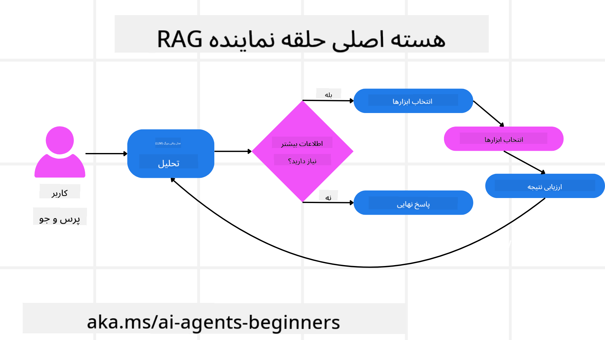
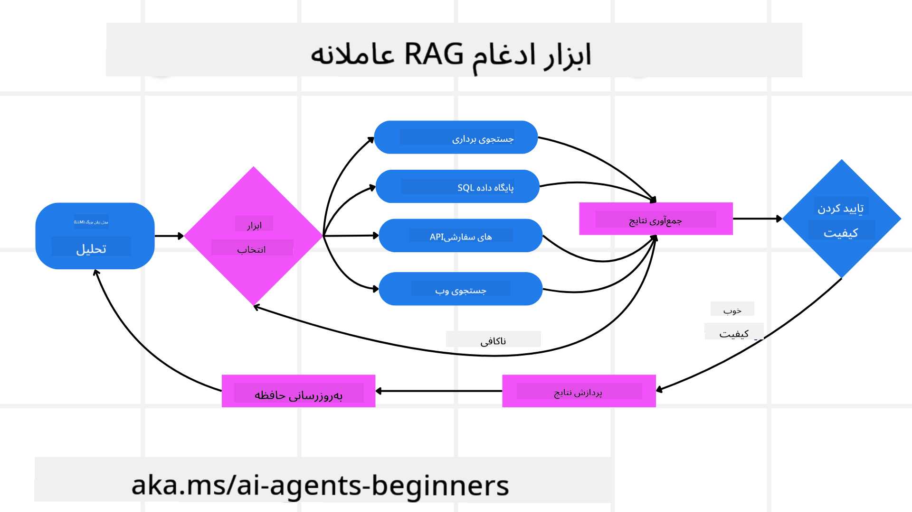
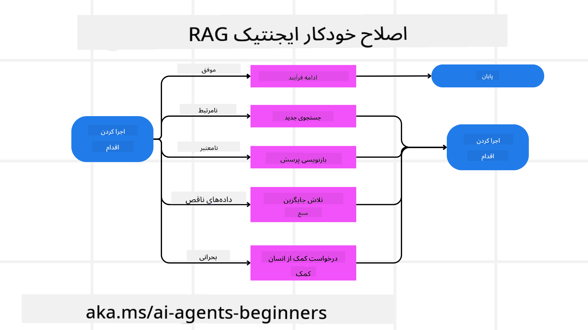

<!--
CO_OP_TRANSLATOR_METADATA:
{
  "original_hash": "4d215d159f2f3b96644fd62657988d23",
  "translation_date": "2025-03-26T19:14:02+00:00",
  "source_file": "05-agentic-rag\\README.md",
  "language_code": "fa"
}
-->

> _(برای مشاهده ویدئوی این درس، روی تصویر بالا کلیک کنید)_

# Agentic RAG

این درس یک مرور جامع بر "تولید بازیابی‌محور عاملی" (Agentic Retrieval-Augmented Generation یا Agentic RAG) ارائه می‌دهد، که یک پارادایم نوظهور در هوش مصنوعی است. در این پارادایم، مدل‌های زبانی بزرگ (LLMs) به‌طور خودکار مراحل بعدی خود را برنامه‌ریزی می‌کنند و اطلاعات را از منابع خارجی استخراج می‌کنند. برخلاف الگوهای ثابت بازیابی و سپس خواندن، Agentic RAG شامل تماس‌های تکراری با LLM است که در میان آنها از ابزارها یا توابع و خروجی‌های ساختاریافته استفاده می‌شود. سیستم نتایج را ارزیابی کرده، پرسش‌ها را اصلاح می‌کند، ابزارهای بیشتری را در صورت نیاز فراخوانی می‌کند و این چرخه را تا رسیدن به یک راه‌حل رضایت‌بخش ادامه می‌دهد.

## مقدمه

این درس شامل موارد زیر خواهد بود:

- **درک Agentic RAG:** یادگیری درباره پارادایم نوظهور در هوش مصنوعی که در آن مدل‌های زبانی بزرگ (LLMs) به‌طور خودکار مراحل بعدی خود را برنامه‌ریزی کرده و اطلاعات را از منابع داده خارجی استخراج می‌کنند.
- **سبک تکراری Maker-Checker:** فهم چرخه تماس‌های تکراری با LLM که با استفاده از ابزارها یا توابع و خروجی‌های ساختاریافته، برای بهبود صحت و مدیریت پرسش‌های ناقص طراحی شده است.
- **بررسی کاربردهای عملی:** شناسایی سناریوهایی که Agentic RAG در آنها برجسته است، مانند محیط‌هایی که صحت اولویت دارد، تعاملات پیچیده با پایگاه داده‌ها، و گردش‌های کاری طولانی‌مدت.

## اهداف یادگیری

پس از تکمیل این درس، شما خواهید دانست چگونه/متوجه خواهید شد:

- **درک Agentic RAG:** یادگیری درباره پارادایم نوظهور در هوش مصنوعی که در آن مدل‌های زبانی بزرگ (LLMs) به‌طور خودکار مراحل بعدی خود را برنامه‌ریزی کرده و اطلاعات را از منابع داده خارجی استخراج می‌کنند.
- **سبک تکراری Maker-Checker:** فهم مفهوم چرخه تماس‌های تکراری با LLM که با استفاده از ابزارها یا توابع و خروجی‌های ساختاریافته، برای بهبود صحت و مدیریت پرسش‌های ناقص طراحی شده است.
- **مالکیت فرآیند استدلال:** فهم توانایی سیستم برای مالکیت فرآیند استدلال خود، تصمیم‌گیری درباره نحوه برخورد با مشکلات بدون وابستگی به مسیرهای از پیش تعریف‌شده.
- **گردش کار:** درک نحوه تصمیم‌گیری مستقل یک مدل عاملی برای بازیابی گزارش‌های روند بازار، شناسایی داده‌های رقبا، همبستگی معیارهای فروش داخلی، ترکیب یافته‌ها، و ارزیابی استراتژی.
- **چرخه‌های تکراری، یکپارچه‌سازی ابزارها و حافظه:** یادگیری درباره وابستگی سیستم به الگوی تعامل چرخه‌ای، حفظ حالت و حافظه در مراحل مختلف برای جلوگیری از حلقه‌های تکراری و تصمیم‌گیری آگاهانه.
- **مدیریت حالت‌های شکست و اصلاح خودکار:** بررسی مکانیسم‌های اصلاح خودکار قدرتمند سیستم، از جمله تکرار و پرسش مجدد، استفاده از ابزارهای تشخیصی، و بازگشت به نظارت انسانی.
- **محدودیت‌های عاملیت:** فهم محدودیت‌های Agentic RAG با تمرکز بر استقلال دامنه‌ای، وابستگی به زیرساخت‌ها، و احترام به محدودیت‌ها.
- **موارد استفاده عملی و ارزش:** شناسایی سناریوهایی که Agentic RAG در آنها برجسته است، مانند محیط‌هایی که صحت اولویت دارد، تعاملات پیچیده با پایگاه داده‌ها، و گردش‌های کاری طولانی‌مدت.
- **حاکمیت، شفافیت و اعتماد:** یادگیری درباره اهمیت حاکمیت و شفافیت، از جمله استدلال قابل توضیح، کنترل سوگیری، و نظارت انسانی.

## Agentic RAG چیست؟

تولید بازیابی‌محور عاملی (Agentic Retrieval-Augmented Generation یا Agentic RAG) یک پارادایم نوظهور در هوش مصنوعی است که در آن مدل‌های زبانی بزرگ (LLMs) به‌طور خودکار مراحل بعدی خود را برنامه‌ریزی می‌کنند و اطلاعات را از منابع خارجی استخراج می‌کنند. برخلاف الگوهای ثابت بازیابی و سپس خواندن، Agentic RAG شامل تماس‌های تکراری با LLM است که در میان آنها از ابزارها یا توابع و خروجی‌های ساختاریافته استفاده می‌شود. سیستم نتایج را ارزیابی کرده، پرسش‌ها را اصلاح می‌کند، ابزارهای بیشتری را در صورت نیاز فراخوانی می‌کند و این چرخه را تا رسیدن به یک راه‌حل رضایت‌بخش ادامه می‌دهد. این سبک تکراری "maker-checker" برای بهبود صحت، مدیریت پرسش‌های ناقص، و تضمین نتایج با کیفیت بالا طراحی شده است.

سیستم فرآیند استدلال خود را به‌طور فعال مدیریت می‌کند، پرسش‌های ناموفق را بازنویسی می‌کند، روش‌های بازیابی متفاوتی را انتخاب می‌کند، و ابزارهای متعددی—مانند جستجوی برداری در Azure AI Search، پایگاه داده‌های SQL، یا APIهای سفارشی—را قبل از نهایی کردن پاسخ خود ادغام می‌کند. کیفیت متمایز یک سیستم عاملی توانایی آن در مالکیت فرآیند استدلال خود است. پیاده‌سازی‌های سنتی RAG به مسیرهای از پیش تعریف‌شده متکی هستند، اما یک سیستم عاملی به‌طور مستقل ترتیب مراحل را بر اساس کیفیت اطلاعاتی که پیدا می‌کند تعیین می‌کند.

## تعریف تولید بازیابی‌محور عاملی (Agentic RAG)

تولید بازیابی‌محور عاملی (Agentic Retrieval-Augmented Generation یا Agentic RAG) یک پارادایم نوظهور در توسعه هوش مصنوعی است که در آن مدل‌های زبانی بزرگ (LLMs) نه تنها اطلاعات را از منابع داده خارجی استخراج می‌کنند بلکه مراحل بعدی خود را نیز به‌طور خودکار برنامه‌ریزی می‌کنند. برخلاف الگوهای ثابت بازیابی و سپس خواندن یا توالی‌های از پیش اسکریپت‌شده، Agentic RAG شامل چرخه تماس‌های تکراری با LLM است که در میان آنها از ابزارها یا توابع و خروجی‌های ساختاریافته استفاده می‌شود. در هر مرحله، سیستم نتایج به‌دست‌آمده را ارزیابی کرده، تصمیم می‌گیرد که آیا پرسش‌ها را اصلاح کند، ابزارهای بیشتری را فراخوانی کند، و این چرخه را ادامه می‌دهد تا به یک راه‌حل رضایت‌بخش برسد.

این سبک تکراری "maker-checker" برای بهبود صحت، مدیریت پرسش‌های ناقص به پایگاه داده‌های ساختاریافته (مانند NL2SQL)، و تضمین نتایج متعادل و با کیفیت بالا طراحی شده است. به جای تکیه صرف بر زنجیره‌های پرسش‌های مهندسی‌شده، سیستم فرآیند استدلال خود را به‌طور فعال مدیریت می‌کند. می‌تواند پرسش‌های ناموفق را بازنویسی کند، روش‌های بازیابی متفاوتی را انتخاب کند، و ابزارهای متعددی—مانند جستجوی برداری در Azure AI Search، پایگاه داده‌های SQL، یا APIهای سفارشی—را قبل از نهایی کردن پاسخ خود ادغام کند. این رویکرد نیاز به چارچوب‌های ارکستراسیون پیچیده را از بین می‌برد. در عوض، یک چرخه نسبتاً ساده از "تماس با LLM → استفاده از ابزار → تماس با LLM → ..." می‌تواند خروجی‌های پیچیده و مستدل را ایجاد کند.

## مالکیت فرآیند استدلال

کیفیت متمایز که یک سیستم را "عاملی" می‌کند توانایی آن در مالکیت فرآیند استدلال خود است. پیاده‌سازی‌های سنتی RAG اغلب به انسان‌ها متکی هستند تا مسیر را برای مدل از پیش تعریف کنند: زنجیره‌ای از افکار که مشخص می‌کند چه چیزی را باید بازیابی کرد و چه زمانی.
اما زمانی که یک سیستم واقعاً عاملی است، خود به‌طور داخلی تصمیم می‌گیرد که چگونه به مشکل نزدیک شود. این فقط اجرای یک اسکریپت نیست؛ بلکه به‌طور مستقل ترتیب مراحل را بر اساس کیفیت اطلاعاتی که پیدا می‌کند تعیین می‌کند.
برای مثال، اگر از آن خواسته شود یک استراتژی راه‌اندازی محصول ایجاد کند، فقط به یک پرسش که کل گردش کار تحقیق و تصمیم‌گیری را توضیح می‌دهد، متکی نیست. در عوض، مدل عاملی به‌طور مستقل تصمیم می‌گیرد:

1. گزارش‌های روند بازار فعلی را با استفاده از Bing Web Grounding بازیابی کند.
2. داده‌های مرتبط با رقبا را با استفاده از Azure AI Search شناسایی کند.
3. معیارهای فروش داخلی تاریخی را با استفاده از Azure SQL Database همبسته کند.
4. یافته‌ها را به یک استراتژی منسجم ترکیب کند که از طریق Azure OpenAI Service هماهنگ شده است.
5. استراتژی را برای شکاف‌ها یا ناسازگاری‌ها ارزیابی کند و در صورت نیاز یک دور دیگر بازیابی را آغاز کند.
تمام این مراحل—اصلاح پرسش‌ها، انتخاب منابع، تکرار تا زمانی که از پاسخ "راضی" باشد—توسط مدل تصمیم‌گیری می‌شود، نه از پیش اسکریپت‌شده توسط یک انسان.

## چرخه‌های تکراری، یکپارچه‌سازی ابزارها و حافظه

یک سیستم عاملی به الگوی تعامل چرخه‌ای متکی است:

- **تماس اولیه:** هدف کاربر (یعنی پرسش کاربر) به LLM ارائه می‌شود.
- **فراخوانی ابزار:** اگر مدل اطلاعات گم‌شده یا دستورالعمل‌های مبهم را شناسایی کند، یک ابزار یا روش بازیابی—مانند پرسش پایگاه داده برداری (مثلاً Azure AI Search Hybrid search برای داده‌های خصوصی) یا یک تماس SQL ساختاریافته—را انتخاب می‌کند تا زمینه بیشتری جمع‌آوری کند.
- **ارزیابی و اصلاح:** پس از بررسی داده‌های بازگشتی، مدل تصمیم می‌گیرد که آیا اطلاعات کافی است یا خیر. اگر نه، پرسش را اصلاح می‌کند، ابزار متفاوتی را امتحان می‌کند، یا رویکرد خود را تنظیم می‌کند.
- **تکرار تا رضایت:** این چرخه ادامه می‌یابد تا زمانی که مدل تعیین کند که وضوح و شواهد کافی برای ارائه یک پاسخ نهایی و مستدل دارد.
- **حافظه و حالت:** چون سیستم حالت و حافظه را در مراحل مختلف حفظ می‌کند، می‌تواند تلاش‌های قبلی و نتایج آنها را به یاد بیاورد، از حلقه‌های تکراری جلوگیری کرده و تصمیمات آگاهانه‌تری در ادامه مسیر بگیرد.

با گذشت زمان، این باعث ایجاد حس درک در حال تکامل می‌شود و مدل را قادر می‌سازد تا وظایف پیچیده و چندمرحله‌ای را بدون نیاز به دخالت مداوم انسان یا تغییر پرسش مدیریت کند.

## مدیریت حالت‌های شکست و اصلاح خودکار

خودمختاری Agentic RAG شامل مکانیسم‌های اصلاح خودکار قدرتمند نیز می‌شود. زمانی که سیستم به بن‌بست می‌رسد—مانند بازیابی اسناد نامربوط یا مواجهه با پرسش‌های ناقص—می‌تواند:

- **تکرار و پرسش مجدد:** به جای ارائه پاسخ‌های کم‌ارزش، مدل استراتژی‌های جستجوی جدیدی را امتحان می‌کند، پرسش‌های پایگاه داده را بازنویسی می‌کند، یا مجموعه‌های داده جایگزین را بررسی می‌کند.
- **استفاده از ابزارهای تشخیصی:** سیستم ممکن است توابع اضافی را فراخوانی کند که برای کمک به اشکال‌زدایی مراحل استدلال یا تأیید صحت داده‌های بازیابی‌شده طراحی شده‌اند. ابزارهایی مانند Azure AI Tracing برای ایجاد قابلیت مشاهده و نظارت قدرتمند بسیار مهم خواهند بود.
- **بازگشت به نظارت انسانی:** برای سناریوهای حساس یا شکست‌های مکرر، مدل ممکن است عدم قطعیت را پرچم‌گذاری کرده و راهنمایی انسانی درخواست کند. پس از اینکه انسان بازخورد اصلاحی ارائه کرد، مدل می‌تواند آن درس را برای ادامه کار خود وارد کند.

این رویکرد تکراری و پویا به مدل اجازه می‌دهد تا به‌طور مداوم بهبود یابد و تضمین کند که فقط یک سیستم تک‌مرحله‌ای نیست بلکه سیستمی است که از اشتباهات خود در طول یک جلسه خاص یاد می‌گیرد.

## محدودیت‌های عاملیت

با وجود خودمختاری در یک وظیفه، Agentic RAG معادل هوش مصنوعی عمومی نیست. قابلیت‌های "عاملی" آن محدود به ابزارها، منابع داده، و سیاست‌هایی است که توسط توسعه‌دهندگان انسانی ارائه شده‌اند. این سیستم نمی‌تواند ابزارهای خود را اختراع کند یا از مرزهای دامنه‌ای که برای آن تعیین شده‌اند خارج شود. در عوض، در ارکستراسیون پویا منابع موجود برجسته است.
تفاوت‌های کلیدی با اشکال پیشرفته‌تر هوش مصنوعی شامل موارد زیر است:

1. **استقلال دامنه‌ای:** سیستم‌های Agentic RAG بر دستیابی به اهداف تعریف‌شده توسط کاربر در یک دامنه شناخته‌شده تمرکز دارند و از استراتژی‌هایی مانند بازنویسی پرسش‌ها یا انتخاب ابزارها برای بهبود نتایج استفاده می‌کنند.
2. **وابسته به زیرساخت:** قابلیت‌های سیستم به ابزارها و داده‌هایی که توسط توسعه‌دهندگان یکپارچه شده‌اند بستگی دارد. این سیستم نمی‌تواند بدون دخالت انسانی از این مرزها فراتر رود.
3. **احترام به محدودیت‌ها:** دستورالعمل‌های اخلاقی، قوانین انطباق، و سیاست‌های کسب‌وکار همچنان بسیار مهم هستند. آزادی عامل همیشه توسط اقدامات ایمنی و مکانیسم‌های نظارتی محدود می‌شود (امیدواریم؟).

## موارد استفاده عملی و ارزش

Agentic RAG در سناریوهایی که نیاز به اصلاح تکراری و دقت دارند برجسته است:

1. **محیط‌های با اولویت صحت:** در بررسی‌های انطباق، تحلیل‌های قانونی، یا تحقیقات حقوقی، مدل عاملی می‌تواند به‌طور مکرر حقایق را تأیید کند، منابع متعدد را مشاوره دهد، و پرسش‌ها را بازنویسی کند تا پاسخی کاملاً بررسی‌شده ارائه دهد.
2. **تعاملات پیچیده با پایگاه داده:** هنگام کار با داده‌های ساختاریافته که پرسش‌ها ممکن است اغلب شکست بخورند یا نیاز به تنظیم داشته باشند، سیستم می‌تواند پرسش‌های خود را به‌طور خودکار با استفاده از Azure SQL یا Microsoft Fabric OneLake اصلاح کند تا بازیابی نهایی با هدف کاربر هماهنگ شود.
3. **گردش‌های کاری طولانی‌مدت:** جلسات طولانی‌تر ممکن است با ظهور اطلاعات جدید تکامل یابند. Agentic RAG می‌تواند به‌طور مداوم داده‌های جدید را وارد کند و استراتژی‌ها را با یادگیری بیشتر درباره فضای مشکل تغییر دهد.

## حاکمیت، شفافیت و اعتماد

با خودمختارتر شدن این سیستم‌ها در فرآیند استدلال، حاکمیت و شفافیت بسیار مهم هستند:

- **استدلال قابل توضیح:** مدل می‌تواند یک مسیر حسابرسی از پرسش‌هایی که انجام داده، منابعی که مشاوره داده، و مراحل استدلالی که برای رسیدن به نتیجه طی کرده است ارائه دهد. ابزارهایی مانند Azure AI Content Safety و Azure AI Tracing / GenAIOps می‌توانند به حفظ شفافیت و کاهش ریسک‌ها کمک کنند.
- **کنترل سوگیری و بازیابی متوازن:** توسعه‌دهندگان می‌توانند استراتژی‌های بازیابی را تنظیم کنند تا اطمینان حاصل شود که منابع داده متوازن و نماینده در نظر گرفته شده‌اند و خروجی‌ها را به‌طور منظم برای شناسایی سوگیری یا الگوهای نامتعادل بررسی کنند.
- **نظارت انسانی و انطباق:** برای وظایف حساس، بررسی انسانی همچنان ضروری است. Agentic RAG جایگزین قضاوت انسانی در تصمیمات حساس نمی‌شود—بلکه آن را با ارائه گزینه‌های کاملاً بررسی‌شده تقویت می‌کند.

داشتن ابزارهایی که یک رکورد واضح از اقدامات ارائه می‌دهند ضروری است. بدون آنها، اشکال‌زدایی یک فرآیند چندمرحله‌ای می‌تواند بسیار دشوار باشد. مثال زیر از Literal AI (شرکتی که Chainlit را ارائه می‌دهد) را برای اجرای عامل ببینید:

## نتیجه‌گیری

Agentic RAG نمایانگر تکامل طبیعی در نحوه برخورد سیستم‌های هوش مصنوعی با وظایف پیچیده و مبتنی بر داده است. با اتخاذ الگوی تعامل چرخه‌ای، انتخاب خودکار ابزارها، و اصلاح پرسش‌ها تا رسیدن به نتیجه با کیفیت بالا، سیستم از پیروی ثابت از پرسش‌ها فراتر رفته و به یک تصمیم‌گیرنده سازگار و آگاه به زمینه تبدیل می‌شود. در حالی که همچنان محدود به زیرساخت‌ها و دستورالعمل‌های اخلاقی تعریف‌شده توسط انسان است، این قابلیت‌های عاملی تعاملات هوش مصنوعی غنی‌تر، پویاتر، و در نهایت مفیدتر را برای شرکت‌ها و کاربران نهایی امکان‌پذیر می‌کند.

## منابع اضافی

- <a href="https://learn.microsoft.com/training/modules/use-own-data-azure-openai" target="_blank">اجرای تولید بازیابی‌محور (RAG) با سرویس Azure OpenAI: یاد بگیرید چگونه از داده‌های خود با سرویس Azure OpenAI استفاده کنید. این ماژول Microsoft Learn راهنمای جامعی برای اجرای RAG ارائه می‌دهد</a>
- <a href="https://learn.microsoft.com/azure/ai-studio/concepts/evaluation-approach-gen-ai" target="_blank">ارزیابی برنامه‌های هوش مصنوعی تولیدی با Azure AI Foundry: این مقاله ارزیابی و مقایسه مدل‌ها را بر اساس مجموعه داده‌های عمومی، از جمله برنامه‌های

**سلب مسئولیت**:  
این سند با استفاده از سرویس ترجمه هوش مصنوعی [Co-op Translator](https://github.com/Azure/co-op-translator) ترجمه شده است. در حالی که ما تلاش می‌کنیم دقت را حفظ کنیم، لطفاً توجه داشته باشید که ترجمه‌های خودکار ممکن است شامل اشتباهات یا نادقتی‌ها باشند. سند اصلی به زبان اصلی آن باید به عنوان منبع معتبر در نظر گرفته شود. برای اطلاعات حساس، توصیه می‌شود از ترجمه حرفه‌ای انسانی استفاده کنید. ما مسئولیتی در قبال هرگونه سوءتفاهم یا تفسیر نادرست ناشی از استفاده از این ترجمه نداریم.