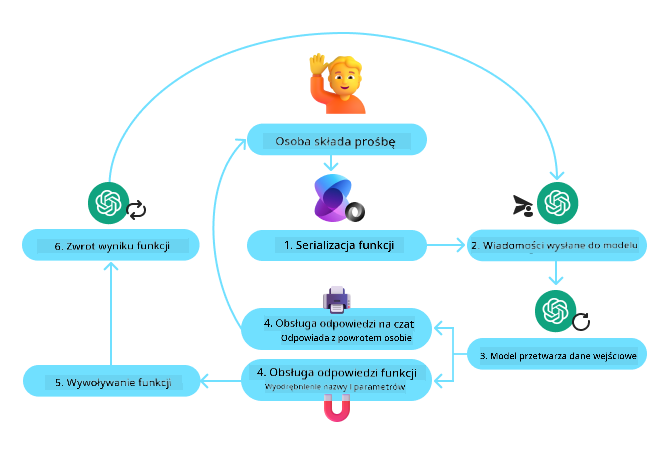
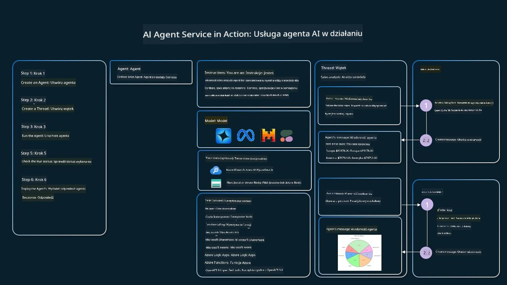

<!--
CO_OP_TRANSLATOR_METADATA:
{
  "original_hash": "b8ea2abd1a674f736d5fc08982e6ec06",
  "translation_date": "2025-03-26T19:06:57+00:00",
  "source_file": "04-tool-use\\README.md",
  "language_code": "pl"
}
-->
[](https://youtu.be/vieRiPRx-gI?si=cEZ8ApnT6Sus9rhn)

> _(Kliknij obrazek powyżej, aby obejrzeć wideo do tej lekcji)_

# Wzorzec projektowy korzystania z narzędzi

Narzędzia są interesujące, ponieważ pozwalają agentom AI na poszerzenie zakresu ich możliwości. Zamiast ograniczonego zestawu działań, które agent może wykonać, dodanie narzędzia umożliwia agentowi realizację szerokiej gamy zadań. W tym rozdziale przyjrzymy się wzorcowi projektowemu korzystania z narzędzi, który opisuje, jak agenci AI mogą używać konkretnych narzędzi do osiągania swoich celów.

## Wprowadzenie

W tej lekcji odpowiemy na następujące pytania:

- Czym jest wzorzec projektowy korzystania z narzędzi?
- Jakie są przypadki użycia, do których można go zastosować?
- Jakie elementy/budulec są potrzebne do wdrożenia wzorca projektowego?
- Jakie szczególne kwestie należy rozważyć, aby budować wiarygodnych agentów AI korzystających z tego wzorca?

## Cele nauki

Po ukończeniu tej lekcji będziesz w stanie:

- Zdefiniować wzorzec projektowy korzystania z narzędzi i jego cel.
- Zidentyfikować przypadki użycia, w których wzorzec projektowy korzystania z narzędzi ma zastosowanie.
- Zrozumieć kluczowe elementy potrzebne do wdrożenia wzorca projektowego.
- Rozpoznać kwestie związane z zapewnieniem wiarygodności agentów AI korzystających z tego wzorca.

## Czym jest wzorzec projektowy korzystania z narzędzi?

**Wzorzec projektowy korzystania z narzędzi** skupia się na umożliwieniu LLM (Large Language Models) interakcji z zewnętrznymi narzędziami w celu osiągnięcia określonych celów. Narzędzia to kod, który może być wykonywany przez agenta w celu realizacji działań. Narzędzie może być prostą funkcją, taką jak kalkulator, lub wywołaniem API do usługi zewnętrznej, na przykład wyszukiwanie cen akcji czy prognoza pogody. W kontekście agentów AI narzędzia są projektowane tak, aby były wykonywane przez agentów w odpowiedzi na **wywołania funkcji generowanych przez model**.

## Jakie są przypadki użycia, do których można go zastosować?

Agenci AI mogą korzystać z narzędzi, aby realizować złożone zadania, pozyskiwać informacje lub podejmować decyzje. Wzorzec projektowy korzystania z narzędzi jest często stosowany w scenariuszach wymagających dynamicznej interakcji z zewnętrznymi systemami, takimi jak bazy danych, usługi internetowe czy interpretery kodu. Ta zdolność jest przydatna w wielu różnych przypadkach użycia, w tym:

- **Dynamiczne pozyskiwanie informacji:** Agenci mogą zapytać zewnętrzne API lub bazy danych, aby uzyskać aktualne dane (np. zapytania do bazy SQLite w celu analizy danych, pozyskiwanie cen akcji lub informacji o pogodzie).
- **Wykonywanie i interpretacja kodu:** Agenci mogą wykonywać kod lub skrypty, aby rozwiązywać problemy matematyczne, generować raporty czy przeprowadzać symulacje.
- **Automatyzacja procesów:** Automatyzowanie powtarzalnych lub wieloetapowych procesów poprzez integrację narzędzi takich jak harmonogramy zadań, usługi e-mail czy przepływy danych.
- **Obsługa klienta:** Agenci mogą wchodzić w interakcję z systemami CRM, platformami do zarządzania zgłoszeniami czy bazami wiedzy w celu rozwiązywania zapytań użytkowników.
- **Tworzenie i edycja treści:** Agenci mogą korzystać z narzędzi takich jak sprawdzanie gramatyki, podsumowywanie tekstu czy ocena bezpieczeństwa treści, aby wspierać zadania związane z tworzeniem treści.

## Jakie elementy/budulec są potrzebne do wdrożenia wzorca projektowego korzystania z narzędzi?

Te elementy pozwalają agentowi AI realizować szeroką gamę zadań. Przyjrzyjmy się kluczowym elementom potrzebnym do wdrożenia wzorca projektowego korzystania z narzędzi:

- **Wywoływanie funkcji/narzędzi:** To główny sposób umożliwienia LLM interakcji z narzędziami. Funkcje lub narzędzia to bloki wielokrotnego użytku kodu, które agenci wykorzystują do realizacji zadań. Mogą to być proste funkcje, takie jak kalkulator, lub wywołania API do usług zewnętrznych, takich jak wyszukiwanie cen akcji czy prognozy pogody.

- **Dynamiczne pozyskiwanie informacji:** Agenci mogą zapytać zewnętrzne API lub bazy danych, aby uzyskać aktualne dane. Jest to przydatne w zadaniach takich jak analiza danych, pozyskiwanie cen akcji czy informacji o pogodzie.

- **Wykonywanie i interpretacja kodu:** Agenci mogą wykonywać kod lub skrypty, aby rozwiązywać problemy matematyczne, generować raporty czy przeprowadzać symulacje.

- **Automatyzacja procesów:** Obejmuje automatyzację powtarzalnych lub wieloetapowych procesów poprzez integrację narzędzi takich jak harmonogramy zadań, usługi e-mail czy przepływy danych.

- **Obsługa klienta:** Agenci mogą wchodzić w interakcję z systemami CRM, platformami do zarządzania zgłoszeniami czy bazami wiedzy w celu rozwiązywania zapytań użytkowników.

- **Tworzenie i edycja treści:** Agenci mogą korzystać z narzędzi takich jak sprawdzanie gramatyki, podsumowywanie tekstu czy ocena bezpieczeństwa treści, aby wspierać zadania związane z tworzeniem treści.

Przejdźmy teraz do bardziej szczegółowego omówienia wywoływania funkcji/narzędzi.

### Wywoływanie funkcji/narzędzi

Wywoływanie funkcji jest głównym sposobem umożliwienia dużym modelom językowym (LLM) interakcji z narzędziami. Często spotyka się wymienne użycie terminów "funkcja" i "narzędzie", ponieważ "funkcje" (bloki wielokrotnego użytku kodu) są "narzędziami", z których korzystają agenci w celu realizacji zadań. Aby kod funkcji mógł zostać wykonany, LLM musi porównać żądanie użytkownika z opisem funkcji. W tym celu do LLM przesyłany jest schemat zawierający opisy wszystkich dostępnych funkcji. Model wybiera najbardziej odpowiednią funkcję do zadania i zwraca jej nazwę oraz argumenty. Wybrana funkcja jest wykonywana, a jej odpowiedź przesyłana z powrotem do LLM, który używa informacji, aby odpowiedzieć na żądanie użytkownika.

Aby deweloperzy mogli zaimplementować wywoływanie funkcji dla agentów, potrzebne będą:

1. Model LLM obsługujący wywoływanie funkcji
2. Schemat zawierający opisy funkcji
3. Kod dla każdej opisanej funkcji

Przykład użycia uzyskania aktualnego czasu w mieście:

1. **Inicjalizacja LLM obsługującego wywoływanie funkcji:**

    Nie wszystkie modele obsługują wywoływanie funkcji, dlatego ważne jest, aby sprawdzić, czy używany LLM to robi. <a href="https://learn.microsoft.com/azure/ai-services/openai/how-to/function-calling" target="_blank">Azure OpenAI</a> obsługuje wywoływanie funkcji. Możemy rozpocząć od inicjalizacji klienta Azure OpenAI.

    ```python
    # Initialize the Azure OpenAI client
    client = AzureOpenAI(
        azure_endpoint = os.getenv("AZURE_OPENAI_ENDPOINT"), 
        api_key=os.getenv("AZURE_OPENAI_API_KEY"),  
        api_version="2024-05-01-preview"
    )
    ```

1. **Tworzenie schematu funkcji:**

    Następnie definiujemy schemat JSON, który zawiera nazwę funkcji, opis jej działania oraz nazwy i opisy parametrów funkcji. Przekazujemy ten schemat do wcześniej utworzonego klienta, wraz z żądaniem użytkownika dotyczącym znalezienia czasu w San Francisco. Ważne jest, aby zauważyć, że zwracane jest **wywołanie narzędzia**, a nie ostateczna odpowiedź na pytanie. Jak wspomniano wcześniej, LLM zwraca nazwę funkcji wybranej do zadania oraz argumenty, które będą do niej przekazane.

    ```python
    # Function description for the model to read
    tools = [
        {
            "type": "function",
            "function": {
                "name": "get_current_time",
                "description": "Get the current time in a given location",
                "parameters": {
                    "type": "object",
                    "properties": {
                        "location": {
                            "type": "string",
                            "description": "The city name, e.g. San Francisco",
                        },
                    },
                    "required": ["location"],
                },
            }
        }
    ]
    ```
   
    ```python
  
    # Initial user message
    messages = [{"role": "user", "content": "What's the current time in San Francisco"}] 
  
    # First API call: Ask the model to use the function
      response = client.chat.completions.create(
          model=deployment_name,
          messages=messages,
          tools=tools,
          tool_choice="auto",
      )
  
      # Process the model's response
      response_message = response.choices[0].message
      messages.append(response_message)
  
      print("Model's response:")  

      print(response_message)
  
    ```

    ```bash
    Model's response:
    ChatCompletionMessage(content=None, role='assistant', function_call=None, tool_calls=[ChatCompletionMessageToolCall(id='call_pOsKdUlqvdyttYB67MOj434b', function=Function(arguments='{"location":"San Francisco"}', name='get_current_time'), type='function')])
    ```
  
1. **Kod funkcji wymagany do realizacji zadania:**

    Teraz, gdy LLM wybrał, która funkcja musi zostać uruchomiona, kod realizujący zadanie musi zostać zaimplementowany i wykonany. Możemy zaimplementować kod do uzyskania aktualnego czasu w Pythonie. Musimy również napisać kod do wyodrębnienia nazwy i argumentów z response_message, aby uzyskać ostateczny wynik.

    ```python
      def get_current_time(location):
        """Get the current time for a given location"""
        print(f"get_current_time called with location: {location}")  
        location_lower = location.lower()
        
        for key, timezone in TIMEZONE_DATA.items():
            if key in location_lower:
                print(f"Timezone found for {key}")  
                current_time = datetime.now(ZoneInfo(timezone)).strftime("%I:%M %p")
                return json.dumps({
                    "location": location,
                    "current_time": current_time
                })
      
        print(f"No timezone data found for {location_lower}")  
        return json.dumps({"location": location, "current_time": "unknown"})
    ```

    ```python
     # Handle function calls
      if response_message.tool_calls:
          for tool_call in response_message.tool_calls:
              if tool_call.function.name == "get_current_time":
     
                  function_args = json.loads(tool_call.function.arguments)
     
                  time_response = get_current_time(
                      location=function_args.get("location")
                  )
     
                  messages.append({
                      "tool_call_id": tool_call.id,
                      "role": "tool",
                      "name": "get_current_time",
                      "content": time_response,
                  })
      else:
          print("No tool calls were made by the model.")  
  
      # Second API call: Get the final response from the model
      final_response = client.chat.completions.create(
          model=deployment_name,
          messages=messages,
      )
  
      return final_response.choices[0].message.content
     ```

    ```bash
      get_current_time called with location: San Francisco
      Timezone found for san francisco
      The current time in San Francisco is 09:24 AM.
     ```

Wywoływanie funkcji jest sercem większości, jeśli nie wszystkich projektów korzystania z narzędzi przez agentów, jednak jego wdrożenie od podstaw może być czasami wyzwaniem. Jak nauczyliśmy się w [Lekcji 2](../../../02-explore-agentic-frameworks), frameworki agentowe dostarczają nam gotowe elementy do wdrożenia korzystania z narzędzi.

## Przykłady korzystania z narzędzi z frameworkami agentowymi

Oto kilka przykładów, jak można wdrożyć wzorzec projektowy korzystania z narzędzi przy użyciu różnych frameworków agentowych:

### Semantic Kernel

<a href="https://learn.microsoft.com/azure/ai-services/agents/overview" target="_blank">Semantic Kernel</a> to otwarty framework AI dla deweloperów .NET, Python i Java pracujących z dużymi modelami językowymi (LLM). Upraszcza proces korzystania z wywoływania funkcji, automatycznie opisując funkcje i ich parametry modelowi poprzez proces zwany <a href="https://learn.microsoft.com/semantic-kernel/concepts/ai-services/chat-completion/function-calling/?pivots=programming-language-python#1-serializing-the-functions" target="_blank">serializacją</a>. Obsługuje również komunikację między modelem a kodem. Kolejną zaletą korzystania z frameworku agentowego, takiego jak Semantic Kernel, jest dostęp do gotowych narzędzi, takich jak <a href="https://github.com/microsoft/semantic-kernel/blob/main/python/samples/getting_started_with_agents/openai_assistant/step4_assistant_tool_file_search.py" target="_blank">File Search</a> czy <a href="https://github.com/microsoft/semantic-kernel/blob/main/python/samples/getting_started_with_agents/openai_assistant/step3_assistant_tool_code_interpreter.py" target="_blank">Code Interpreter</a>.

Poniższy diagram ilustruje proces wywoływania funkcji z Semantic Kernel:



W Semantic Kernel funkcje/narzędzia nazywane są <a href="https://learn.microsoft.com/semantic-kernel/concepts/plugins/?pivots=programming-language-python" target="_blank">Pluginami</a>. Możemy skonwertować `get_current_time` function we saw earlier into a plugin by turning it into a class with the function in it. We can also import the `kernel_function` za pomocą dekoratora, który przyjmuje opis funkcji. Tworząc kernel z GetCurrentTimePlugin, kernel automatycznie serializuje funkcję i jej parametry, tworząc schemat do przesłania do LLM w procesie.

```python
from semantic_kernel.functions import kernel_function

class GetCurrentTimePlugin:
    async def __init__(self, location):
        self.location = location

    @kernel_function(
        description="Get the current time for a given location"
    )
    def get_current_time(location: str = ""):
        ...

```

```python 
from semantic_kernel import Kernel

# Create the kernel
kernel = Kernel()

# Create the plugin
get_current_time_plugin = GetCurrentTimePlugin(location)

# Add the plugin to the kernel
kernel.add_plugin(get_current_time_plugin)
```
  
### Azure AI Agent Service

<a href="https://learn.microsoft.com/azure/ai-services/agents/overview" target="_blank">Azure AI Agent Service</a> to nowy framework agentowy zaprojektowany, aby umożliwić deweloperom bezpieczne budowanie, wdrażanie i skalowanie wysokiej jakości, rozszerzalnych agentów AI bez konieczności zarządzania zasobami obliczeniowymi i przechowywania danych. Jest szczególnie przydatny w aplikacjach korporacyjnych, ponieważ jest w pełni zarządzaną usługą z zabezpieczeniami klasy korporacyjnej.

W porównaniu z programowaniem bezpośrednio z API LLM, Azure AI Agent Service oferuje kilka zalet, w tym:

- Automatyczne wywoływanie narzędzi – brak potrzeby parsowania wywołania narzędzia, uruchamiania narzędzia i obsługi odpowiedzi; wszystko to odbywa się po stronie serwera
- Bezpieczne zarządzanie danymi – zamiast zarządzania stanem rozmowy, można polegać na wątkach do przechowywania wszystkich potrzebnych informacji
- Gotowe narzędzia – Narzędzia, które można wykorzystać do interakcji z źródłami danych, takie jak Bing, Azure AI Search i Azure Functions.

Narzędzia dostępne w Azure AI Agent Service można podzielić na dwie kategorie:

1. Narzędzia wiedzy:
    - <a href="https://learn.microsoft.com/azure/ai-services/agents/how-to/tools/bing-grounding?tabs=python&pivots=overview" target="_blank">Grounding z Bing Search</a>
    - <a href="https://learn.microsoft.com/azure/ai-services/agents/how-to/tools/file-search?tabs=python&pivots=overview" target="_blank">File Search</a>
    - <a href="https://learn.microsoft.com/azure/ai-services/agents/how-to/tools/azure-ai-search?tabs=azurecli%2Cpython&pivots=overview-azure-ai-search" target="_blank">Azure AI Search</a>

2. Narzędzia akcji:
    - <a href="https://learn.microsoft.com/azure/ai-services/agents/how-to/tools/function-calling?tabs=python&pivots=overview" target="_blank">Wywoływanie funkcji</a>
    - <a href="https://learn.microsoft.com/azure/ai-services/agents/how-to/tools/code-interpreter?tabs=python&pivots=overview" target="_blank">Code Interpreter</a>
    - <a href="https://learn.microsoft.com/azure/ai-services/agents/how-to/tools/openapi-spec?tabs=python&pivots=overview" target="_blank">Narzędzia zdefiniowane przez OpenAI</a>
    - <a href="https://learn.microsoft.com/azure/ai-services/agents/how-to/tools/azure-functions?pivots=overview" target="_blank">Azure Functions</a>

Usługa Agent Service pozwala na użycie tych narzędzi razem jako `toolset`. It also utilizes `threads` which keep track of the history of messages from a particular conversation.

Imagine you are a sales agent at a company called Contoso. You want to develop a conversational agent that can answer questions about your sales data.

The following image illustrates how you could use Azure AI Agent Service to analyze your sales data:



To use any of these tools with the service we can create a client and define a tool or toolset. To implement this practically we can use the following Python code. The LLM will be able to look at the toolset and decide whether to use the user created function, `fetch_sales_data_using_sqlite_query`, lub gotowego Code Interpreter w zależności od żądania użytkownika.

```python 
import os
from azure.ai.projects import AIProjectClient
from azure.identity import DefaultAzureCredential
from fecth_sales_data_functions import fetch_sales_data_using_sqlite_query # fetch_sales_data_using_sqlite_query function which can be found in a fetch_sales_data_functions.py file.
from azure.ai.projects.models import ToolSet, FunctionTool, CodeInterpreterTool

project_client = AIProjectClient.from_connection_string(
    credential=DefaultAzureCredential(),
    conn_str=os.environ["PROJECT_CONNECTION_STRING"],
)

# Initialize function calling agent with the fetch_sales_data_using_sqlite_query function and adding it to the toolset
fetch_data_function = FunctionTool(fetch_sales_data_using_sqlite_query)
toolset = ToolSet()
toolset.add(fetch_data_function)

# Initialize Code Interpreter tool and adding it to the toolset. 
code_interpreter = code_interpreter = CodeInterpreterTool()
toolset = ToolSet()
toolset.add(code_interpreter)

agent = project_client.agents.create_agent(
    model="gpt-4o-mini", name="my-agent", instructions="You are helpful agent", 
    toolset=toolset
)
```

## Jakie szczególne kwestie należy rozważyć, aby budować wiarygodnych agentów AI korzystających z wzorca projektowego korzystania z narzędzi?

Częstym problemem związanym z dynamicznie generowanym przez LLM SQL jest bezpieczeństwo, w szczególności ryzyko ataków typu SQL injection lub złośliwych działań, takich jak usunięcie lub manipulacja bazą danych. Chociaż obawy te są uzasadnione, można je skutecznie złagodzić poprzez odpowiednią konfigurację uprawnień dostępu do bazy danych. Dla większości baz danych oznacza to skonfigurowanie bazy jako tylko do odczytu. W przypadku usług baz danych, takich jak PostgreSQL czy Azure SQL, aplikacji powinno być przypisane tylko do odczytu (SELECT).

Uruchamianie aplikacji w bezpiecznym środowisku dodatkowo zwiększa ochronę. W scenariuszach korporacyjnych dane są zazwyczaj ekstraktowane i transformowane z systemów operacyjnych do bazy danych tylko do odczytu lub hurtowni danych z przyjaznym dla użytkownika schematem. Podejście to zapewnia, że dane są bezpieczne, zoptymalizowane pod kątem wydajności i dostępności, a aplikacja ma ograniczony dostęp tylko do odczytu.

## Dodatkowe zasoby

- <a href="https://microsoft.github.io/build-your-first-agent-with-azure-ai-agent-service-workshop/" target="_blank">Warsztat Azure AI Agents Service</a>
- <a href="https://github.com/Azure-Samples/contoso-creative-writer/tree/main/docs/workshop" target="_blank">Warsztat wieloagentowy Contoso Creative Writer</a>
- <a href="https://learn.microsoft.com/semantic-kernel/concepts/ai-services/chat-completion/function-calling/?pivots=programming-language-python#1-serializing-the-functions" target="_blank">Tutorial wywoływania funkcji w Semantic Kernel</a>
- <a href="https://github.com/microsoft/semantic-kernel/blob/main/python/samples/getting_started_with_agents/openai_assistant/step3_assistant_tool_code_interpreter.py" target="_blank">Interpreter kodu w Semantic Kernel</a>
- <a href="https://microsoft.github.io/autogen/dev/user-guide/core-user-guide/components/tools.html" target="_blank">Narzędzia Autogen</a>

## Poprzednia lekcja

[Zrozumienie wzorców projektowych agentów](../03-agentic-design-patterns/README.md)

## Następ

**Zastrzeżenie**:  
Ten dokument został przetłumaczony za pomocą usługi tłumaczeniowej AI [Co-op Translator](https://github.com/Azure/co-op-translator). Choć dokładamy wszelkich starań, aby tłumaczenie było poprawne, należy pamiętać, że automatyczne tłumaczenia mogą zawierać błędy lub nieścisłości. Oryginalny dokument w jego języku źródłowym powinien być uznawany za wiarygodne źródło. W przypadku informacji kluczowych zaleca się skorzystanie z profesjonalnego tłumaczenia przez człowieka. Nie ponosimy odpowiedzialności za wszelkie nieporozumienia lub błędne interpretacje wynikające z korzystania z tego tłumaczenia.