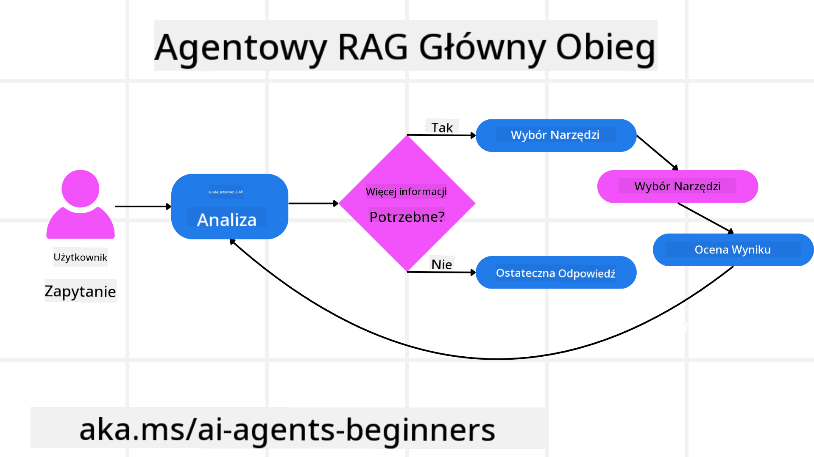
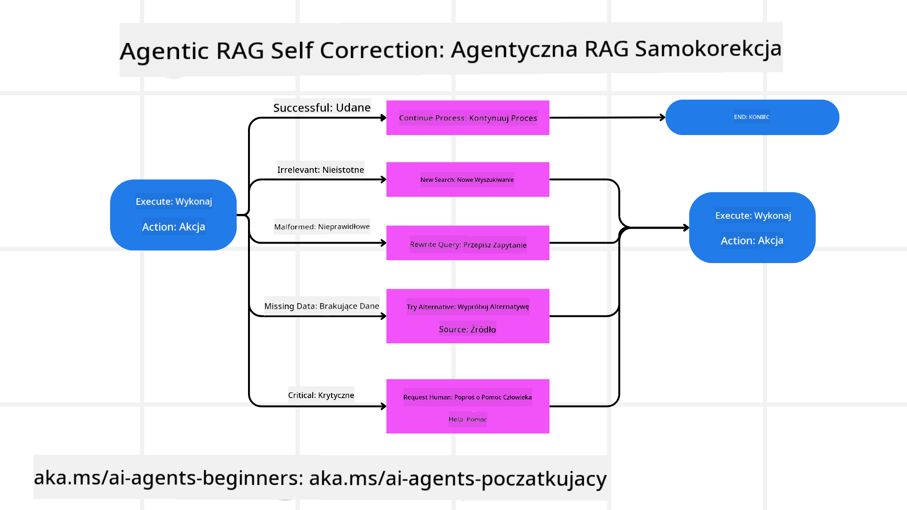

<!--
CO_OP_TRANSLATOR_METADATA:
{
  "original_hash": "4d215d159f2f3b96644fd62657988d23",
  "translation_date": "2025-03-26T19:11:22+00:00",
  "source_file": "05-agentic-rag\\README.md",
  "language_code": "pl"
}
-->

> _(Kliknij obrazek powyżej, aby obejrzeć wideo z tej lekcji)_

# Agentic RAG

Ta lekcja dostarcza szczegółowego przeglądu Agentic Retrieval-Augmented Generation (Agentic RAG), nowego paradygmatu AI, w którym duże modele językowe (LLM) samodzielnie planują kolejne kroki, jednocześnie korzystając z informacji z zewnętrznych źródeł. W przeciwieństwie do statycznych wzorców retrieve-then-read, Agentic RAG obejmuje iteracyjne wywołania LLM, przeplatane użyciem narzędzi lub funkcji oraz generowaniem ustrukturyzowanych wyników. System ocenia wyniki, udoskonala zapytania, wywołuje dodatkowe narzędzia, jeśli to konieczne, i kontynuuje ten cykl, aż osiągnie satysfakcjonujące rozwiązanie.

## Wprowadzenie

Ta lekcja obejmuje:

- **Zrozumienie Agentic RAG:** Poznaj nowy paradygmat w AI, w którym duże modele językowe (LLM) samodzielnie planują kolejne kroki, jednocześnie korzystając z danych z zewnętrznych źródeł.
- **Styl Iteracyjny Maker-Checker:** Zrozum pętlę iteracyjnych wywołań LLM, przeplataną użyciem narzędzi lub funkcji oraz generowaniem ustrukturyzowanych wyników, zaprojektowaną w celu poprawy dokładności i obsługi błędnych zapytań.
- **Odkrywanie praktycznych zastosowań:** Zidentyfikuj scenariusze, w których Agentic RAG sprawdza się najlepiej, takie jak środowiska wymagające najwyższej poprawności, skomplikowane interakcje z bazami danych i rozbudowane przepływy pracy.

## Cele nauki

Po ukończeniu tej lekcji będziesz wiedzieć, jak/zrozumiesz:

- **Zrozumienie Agentic RAG:** Poznaj nowy paradygmat w AI, w którym duże modele językowe (LLM) samodzielnie planują kolejne kroki, jednocześnie korzystając z danych z zewnętrznych źródeł.
- **Styl Iteracyjny Maker-Checker:** Zrozum koncepcję pętli iteracyjnych wywołań LLM, przeplatanych użyciem narzędzi lub funkcji oraz generowaniem ustrukturyzowanych wyników, zaprojektowaną w celu poprawy dokładności i obsługi błędnych zapytań.
- **Przejmowanie procesu rozumowania:** Zrozum zdolność systemu do przejmowania procesu rozumowania, podejmowania decyzji o sposobie podejścia do problemów bez polegania na z góry zdefiniowanych ścieżkach.
- **Przepływ pracy:** Zrozum, jak model agentowy samodzielnie decyduje o pozyskiwaniu raportów o trendach rynkowych, identyfikowaniu danych konkurencji, korelowaniu wewnętrznych metryk sprzedaży, syntezowaniu wyników i ocenie strategii.
- **Pętle iteracyjne, integracja narzędzi i pamięć:** Poznaj zależność systemu od wzorca interakcji w pętli, utrzymując stan i pamięć na kolejnych etapach, aby unikać powtarzających się pętli i podejmować świadome decyzje.
- **Obsługa trybów awaryjnych i autokorekta:** Zbadaj mechanizmy autokorekty systemu, w tym iterację i ponowne zapytania, korzystanie z narzędzi diagnostycznych i poleganie na nadzorze ludzkim.
- **Granice autonomii:** Zrozum ograniczenia Agentic RAG, koncentrując się na autonomii specyficznej dla domeny, zależności od infrastruktury i przestrzeganiu zasad bezpieczeństwa.
- **Praktyczne przypadki użycia i wartość:** Zidentyfikuj scenariusze, w których Agentic RAG sprawdza się najlepiej, takie jak środowiska wymagające najwyższej poprawności, skomplikowane interakcje z bazami danych i rozbudowane przepływy pracy.
- **Zarządzanie, przejrzystość i zaufanie:** Dowiedz się, jak ważne są zarządzanie i przejrzystość, w tym wyjaśnialność rozumowania, kontrola uprzedzeń i nadzór ludzki.

## Czym jest Agentic RAG?

Agentic Retrieval-Augmented Generation (Agentic RAG) to nowy paradygmat AI, w którym duże modele językowe (LLM) samodzielnie planują kolejne kroki, jednocześnie korzystając z informacji z zewnętrznych źródeł. W przeciwieństwie do statycznych wzorców retrieve-then-read, Agentic RAG obejmuje iteracyjne wywołania LLM, przeplatane użyciem narzędzi lub funkcji oraz generowaniem ustrukturyzowanych wyników. System ocenia wyniki, udoskonala zapytania, wywołuje dodatkowe narzędzia, jeśli to konieczne, i kontynuuje ten cykl, aż osiągnie satysfakcjonujące rozwiązanie. Ten iteracyjny styl „maker-checker” poprawia dokładność, obsługuje błędne zapytania i zapewnia wysoką jakość wyników.

System aktywnie przejmuje proces rozumowania, przepisując błędne zapytania, wybierając różne metody pozyskiwania informacji i integrując wiele narzędzi – takich jak wyszukiwanie wektorowe w Azure AI Search, bazy danych SQL czy niestandardowe API – zanim sfinalizuje odpowiedź. Cechą wyróżniającą system agentowy jest jego zdolność do samodzielnego przejmowania procesu rozumowania. Tradycyjne implementacje RAG opierają się na z góry zdefiniowanych ścieżkach, ale system agentowy samodzielnie określa sekwencję kroków w oparciu o jakość znalezionych informacji.

## Definicja Agentic Retrieval-Augmented Generation (Agentic RAG)

Agentic Retrieval-Augmented Generation (Agentic RAG) to nowy paradygmat w rozwoju AI, w którym LLM nie tylko pozyskują informacje z zewnętrznych źródeł danych, ale także samodzielnie planują kolejne kroki. W przeciwieństwie do statycznych wzorców retrieve-then-read czy starannie zaplanowanych sekwencji promptów, Agentic RAG obejmuje pętlę iteracyjnych wywołań LLM, przeplataną użyciem narzędzi lub funkcji oraz generowaniem ustrukturyzowanych wyników. Na każdym etapie system ocenia uzyskane wyniki, decyduje, czy udoskonalić zapytania, wywołuje dodatkowe narzędzia, jeśli to konieczne, i kontynuuje ten cykl, aż osiągnie satysfakcjonujące rozwiązanie.

Ten iteracyjny styl działania „maker-checker” został zaprojektowany w celu poprawy dokładności, obsługi błędnych zapytań do ustrukturyzowanych baz danych (np. NL2SQL) oraz zapewnienia zrównoważonych i wysokiej jakości wyników. Zamiast polegać wyłącznie na starannie zaprojektowanych łańcuchach promptów, system aktywnie przejmuje proces rozumowania. Może przepisywać nieudane zapytania, wybierać różne metody pozyskiwania informacji i integrować wiele narzędzi – takich jak wyszukiwanie wektorowe w Azure AI Search, bazy danych SQL czy niestandardowe API – zanim sfinalizuje odpowiedź. Dzięki temu nie ma potrzeby stosowania skomplikowanych struktur orkiestracyjnych. Prosta pętla „wywołanie LLM → użycie narzędzia → wywołanie LLM → …” może prowadzić do zaawansowanych i dobrze ugruntowanych wyników.

## Przejmowanie procesu rozumowania

Cechą wyróżniającą system „agentowy” jest jego zdolność do przejmowania procesu rozumowania. Tradycyjne implementacje RAG często polegają na tym, że ludzie definiują ścieżkę dla modelu: łańcuch myślowy, który określa, co pozyskać i kiedy.  
Jednak w systemie rzeczywiście agentowym decyzje dotyczące podejścia do problemu podejmowane są wewnętrznie. Nie wykonuje on po prostu skryptu; samodzielnie określa sekwencję kroków w oparciu o jakość znalezionych informacji.  
Na przykład, jeśli system ma stworzyć strategię wprowadzenia produktu na rynek, nie polega wyłącznie na promcie, który określa cały proces badawczy i decyzyjny. Zamiast tego model agentowy samodzielnie decyduje, aby:

1. Pozyskać raporty o bieżących trendach rynkowych za pomocą Bing Web Grounding.
2. Zidentyfikować dane dotyczące konkurencji przy użyciu Azure AI Search.
3. Skojarzyć historyczne wewnętrzne metryki sprzedaży przy użyciu Azure SQL Database.
4. Zsyntetyzować wnioski w spójną strategię, korzystając z Azure OpenAI Service.
5. Ocenić strategię pod kątem luk lub niespójności, inicjując kolejną rundę pozyskiwania informacji, jeśli to konieczne.  

Wszystkie te kroki – udoskonalanie zapytań, wybór źródeł, iteracja aż do uzyskania satysfakcjonującej odpowiedzi – są podejmowane przez model, a nie z góry zaplanowane przez człowieka.

## Iteracyjne pętle, integracja narzędzi i pamięć

System agentowy opiera się na wzorcu interakcji w pętli:

- **Pierwsze wywołanie:** Cel użytkownika (tzw. prompt użytkownika) jest przedstawiany LLM.
- **Wywołanie narzędzia:** Jeśli model identyfikuje brakujące informacje lub niejednoznaczne instrukcje, wybiera narzędzie lub metodę pozyskiwania – np. zapytanie do bazy danych wektorowych (np. Azure AI Search Hybrid search nad danymi prywatnymi) lub ustrukturyzowane zapytanie SQL – aby uzyskać więcej kontekstu.
- **Ocena i udoskonalenie:** Po przeanalizowaniu zwróconych danych model decyduje, czy informacje są wystarczające. Jeśli nie, udoskonala zapytanie, próbuje innego narzędzia lub dostosowuje swoje podejście.
- **Powtarzanie do skutku:** Cykl ten trwa, aż model uzna, że ma wystarczającą jasność i dowody, aby dostarczyć ostateczną, dobrze uzasadnioną odpowiedź.
- **Pamięć i stan:** Ponieważ system utrzymuje stan i pamięć na kolejnych etapach, może przypominać sobie poprzednie próby i ich wyniki, unikając powtarzających się pętli i podejmując bardziej świadome decyzje w miarę postępu.

Z czasem tworzy to wrażenie rozwijającego się zrozumienia, umożliwiając modelowi realizację złożonych, wieloetapowych zadań bez potrzeby ciągłej interwencji człowieka lub modyfikacji promptu.

## Obsługa trybów awaryjnych i autokorekta

Autonomia Agentic RAG obejmuje również solidne mechanizmy autokorekty. Kiedy system napotyka trudności – takie jak pozyskiwanie nieistotnych dokumentów lub błędne zapytania – może:

- **Iterować i ponownie zapytać:** Zamiast zwracać mało wartościowe odpowiedzi, model podejmuje nowe strategie wyszukiwania, przepisuje zapytania do bazy danych lub analizuje alternatywne zestawy danych.
- **Korzystać z narzędzi diagnostycznych:** System może wywoływać dodatkowe funkcje zaprojektowane w celu pomocy w debugowaniu kroków rozumowania lub potwierdzaniu poprawności pozyskanych danych. Narzędzia takie jak Azure AI Tracing będą kluczowe dla zapewnienia solidnej obserwowalności i monitorowania.
- **Polegać na nadzorze ludzkim:** W sytuacjach o wysokim ryzyku lub powtarzających się niepowodzeniach model może oznaczyć niepewność i poprosić o wskazówki od człowieka. Po udzieleniu korekty przez człowieka model może uwzględnić tę lekcję w dalszych działaniach.

To iteracyjne i dynamiczne podejście pozwala modelowi na ciągłe doskonalenie, zapewniając, że nie jest to system działający jednorazowo, ale taki, który uczy się na swoich błędach w trakcie danej sesji.

## Granice autonomii

Pomimo swojej autonomii w ramach zadania, Agentic RAG nie jest równoważny ze Sztuczną Inteligencją Ogólną. Jego „agentowe” możliwości ograniczają się do narzędzi, źródeł danych i polityk dostarczonych przez ludzkich twórców. Nie może samodzielnie tworzyć nowych narzędzi ani wychodzić poza ustalone granice domeny. Zamiast tego doskonale radzi sobie z dynamicznym zarządzaniem dostępnymi zasobami.  
Kluczowe różnice w stosunku do bardziej zaawansowanych form AI obejmują:

1. **Autonomia specyficzna dla domeny:** Systemy Agentic RAG koncentrują się na osiąganiu celów zdefiniowanych przez użytkownika w znanej domenie, stosując strategie takie jak przepisywanie zapytań czy wybór narzędzi w celu poprawy wyników.
2. **Zależność od infrastruktury:** Możliwości systemu zależą od narzędzi i danych zintegrowanych przez programistów. Nie może przekroczyć tych granic bez interwencji człowieka.
3. **Przestrzeganie zasad bezpieczeństwa:** Zasady etyczne, przepisy zgodności i polityki biznesowe pozostają niezwykle ważne. Wolność agenta zawsze jest ograniczona przez mechanizmy bezpieczeństwa i nadzoru (miejmy nadzieję?).

## Praktyczne przypadki użycia i wartość

Agentic RAG sprawdza się w scenariuszach wymagających iteracyjnego doskonalenia i precyzji:

1. **Środowiska wymagające najwyższej poprawności:** W kontrolach zgodności, analizie regulacyjnej lub badaniach prawnych model agentowy może wielokrotnie weryfikować fakty, konsultować się z wieloma źródłami i przepisywać zapytania, aż uzyska dokładnie zweryfikowaną odpowiedź.
2. **Skomplikowane interakcje z bazami danych:** Podczas pracy z danymi ustrukturyzowanymi, gdzie zapytania często mogą się nie powieść lub wymagać dostosowania, system może samodzielnie udoskonalać zapytania, korzystając z Azure SQL lub Microsoft Fabric OneLake, zapewniając, że końcowe wyniki są zgodne z zamiarem użytkownika.
3. **Rozbudowane przepływy pracy:** Dłuższe sesje mogą ewoluować w miarę pojawiania się nowych informacji. Agentic RAG może stale uwzględniać nowe dane, zmieniając strategie w miarę zdobywania większej wiedzy o problemie.

## Zarządzanie, przejrzystość i zaufanie

W miarę jak te systemy stają się bardziej autonomiczne w swoim rozumowaniu, zarządzanie i przejrzystość są kluczowe:

- **Wyjaśnialne rozumowanie:** Model może dostarczać ścieżkę audytu zapytań, które wykonał, źródeł, z których korzystał, oraz kroków rozumowania, które podjął, aby dojść do swojego wniosku. Narzędzia takie jak Azure AI Content Safety i Azure AI Tracing / GenAIOps mogą pomóc w utrzymaniu przejrzystości i minimalizowaniu ryzyka.
- **Kontrola uprzedzeń i zrównoważone pozyskiwanie:** Programiści mogą dostosować strategie pozyskiwania, aby zapewnić uwzględnienie zrównoważonych, reprezentatywnych źródeł danych, oraz regularnie audytować wyniki, aby wykrywać uprzedzenia lub nierównomierne wzorce, korzystając z niestandardowych modeli dla zaawansowanych organizacji zajmujących się nauką o danych przy użyciu Azure Machine Learning.
- **Nadzór ludzki i zgodność:** W przypadku zadań wrażliwych przegląd ludzki pozostaje niezbędny. Agentic RAG nie zastępuje ludzkiego osądu w decyzjach o wysokiej stawce – wspiera go, dostarczając bardziej dokładnie zweryfikowane opcje.

Posiadanie narzędzi, które dostarczają jasnego zapisu działań, jest niezbędne. Bez nich debugowanie wieloetapowego procesu może być bardzo trudne. Zobacz poniższy przykład od Literal AI (firma stojąca za Chainlit) dotyczący działania agenta:

. Chociaż dokładamy wszelkich starań, aby tłumaczenie było precyzyjne, prosimy mieć na uwadze, że automatyczne tłumaczenia mogą zawierać błędy lub nieścisłości. Oryginalny dokument w jego języku źródłowym powinien być traktowany jako wiarygodne źródło. W przypadku informacji o kluczowym znaczeniu zaleca się skorzystanie z profesjonalnego tłumaczenia przez człowieka. Nie ponosimy odpowiedzialności za jakiekolwiek nieporozumienia lub błędne interpretacje wynikające z użycia tego tłumaczenia.